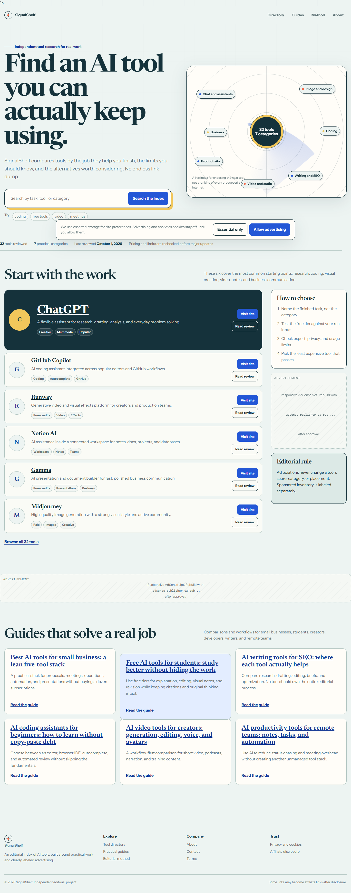
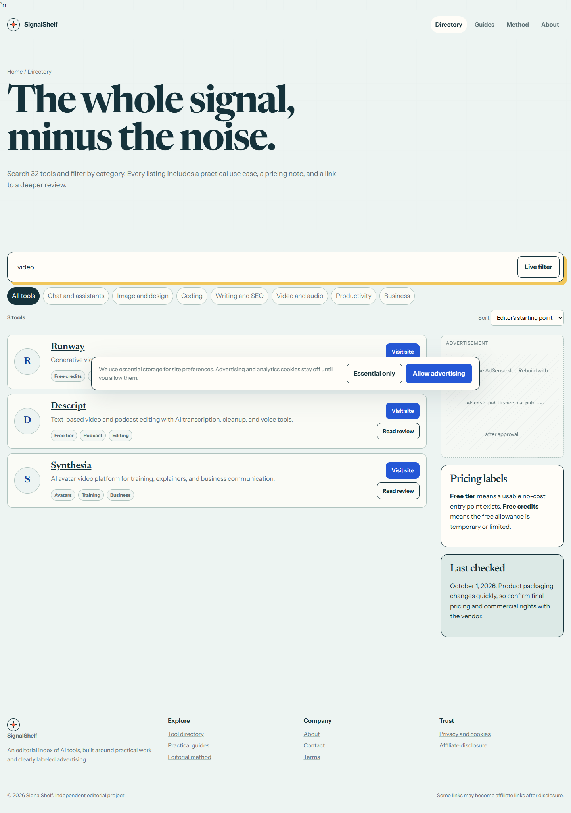
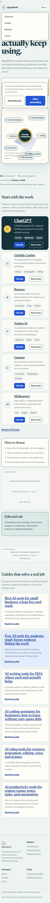

# SignalShelf：AI 工具導航站 + AdSense 模式

這個專案依照使用者提供影片中的商業模式重建，但不採用「零內容、無審核大量 AI 文章」這種高風險做法。

核心模式：

- 英文 AI 工具導航網站
- 32 個工具評測頁
- 7 個分類頁
- 10 篇可發佈的研究型工作流文章
- 100 篇 SEO 主題規劃
- Google AdSense 預留位
- AdSense、隱私、Cookie、揭露、條款頁面
- GitHub + Vercel 靜態部署

## 預覽







## 目錄結構

```text
site/                      可直接部署的靜態網站
  assets/styles.css        視覺系統
  assets/app.js            搜尋、篩選、排序、同意提示
  tools/                   32 個工具頁
  category/                7 個分類頁
  guides/                  10 篇文章
  index.html
  directory.html
  privacy.html
  terms.html
  editorial-policy.html
  sitemap.xml
  robots.txt
  ads.txt

scripts/
  build_site.py            重新產生整個網站
  tools_data_1.json        工具資料 1
  tools_data_2.json        工具資料 2
  check_site.py            內部連結檢查
  test_site.js             瀏覽器與互動測試

docs/
  00-影片拆解.md           影片模式與時間點整理
  01-上線SOP.md            從驗證方向到部署的流程
  02-content-plan.csv      100 篇文章規劃
  03-AdSense合規清單.md    申請與上線前檢查
  04-AI提示詞.md           建站、文章與審稿提示詞
```

## 本機預覽

在專案根目錄執行：

```powershell
& 'C:\Users\syush\.cache\codex-runtimes\codex-primary-runtime\dependencies\python\python.exe' `
  -m http.server 4173 `
  --directory 'C:\Users\syush\Documents\ChatGPT\廣告收入設定\site'
```

瀏覽器開啟 `http://127.0.0.1:4173/`。

## 重新建置

```powershell
& 'C:\Users\syush\.cache\codex-runtimes\codex-primary-runtime\dependencies\python\python.exe' `
  'C:\Users\syush\Documents\ChatGPT\廣告收入設定\scripts\build_site.py' `
  --base-url 'https://你的網域.com'
```

通過 AdSense 後：

```powershell
& 'C:\Users\syush\.cache\codex-runtimes\codex-primary-runtime\dependencies\python\python.exe' `
  'C:\Users\syush\Documents\ChatGPT\廣告收入設定\scripts\build_site.py' `
  --base-url 'https://你的網域.com' `
  --adsense-publisher 'ca-pub-你的ID'
```

重新建置前先把 `site/assets/styles.css` 和 `site/assets/app.js` 備份或放進版本控制；建置腳本會更新 HTML、sitemap、robots、ads.txt 與 CSV，但不會改寫這兩個資產檔。

## 部署到 Vercel

1. 建立 GitHub repository。
2. 將整個專案提交並推送。
3. 到 Vercel 匯入 repository。
4. 根目錄 `vercel.json` 已設定 `site/` 為靜態輸出目錄。
5. 設定正式網域。
6. 用新的網域重新執行建置，讓 canonical、sitemap、robots 與 ads.txt 使用正式網址。
7. 在 Google Search Console 提交 sitemap。

## 上線前必須替換

- `hello@example.com`
- `https://example.com`
- 關於頁的公司資訊
- 隱私權與條款頁的正式法務文字
- `ads.txt`
- Google AdSense publisher ID
- 每個工具頁的價格、功能、限制與 reviewed date
- 10 篇文章已附來源與 review date；有實際使用經驗時應再補上截圖與第一手觀察

## 測試

```powershell
& 'C:\Users\syush\.cache\codex-runtimes\codex-primary-runtime\dependencies\python\python.exe' `
  'C:\Users\syush\Documents\ChatGPT\廣告收入設定\scripts\check_site.py'

& 'C:\Users\syush\.cache\codex-runtimes\codex-primary-runtime\dependencies\node\bin\node.exe' `
  'C:\Users\syush\Documents\ChatGPT\廣告收入設定\scripts\test_site.js'
```

## 重要限制

這個專案是網站與流程 starter，不是收入保證。AdSense 是否核准、流量成長速度、RPM 與廣告收益都由 Google 政策、內容品質、市場競爭、地區、季節與實際流量決定。

